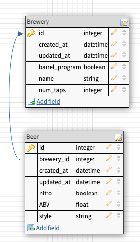

# Brewery Manager
---
 

## Brewery Manager Project Description
#### Brewery Manager is a web application utilizing CRUD (Create, Read, Update, Destroy) functionality with a one-to-many database relationship.  The 'Breweries' parent table is associated with the 'Beers' child table by way of :brewery_id key.  This application follows RESTful best practices.
 

#### <i><u>Brewery - Beers Tables</u></i>

---
 

## Installation
 

#### To install, please clone the following repository to your local machine:
[Relational Rails](https://github.com/aj-bailey/relational_rails)

---
 

## Executing
 

#### The following are steps for executing Night Writer:
1. Open your terminal
2. Navigate to root directory of the program
3. Run `bundle install`
4. Run `rails db:{drop,create,migrate,seed}`
5. Run `rails server`
6. Open your Chrome web browser
7. Enter `http://localhost:3000/` into your address bar
8. When finished, press `Ctrl+C` in your terminal to close server
 
 

---
 

## Future Goals
- Add Beer attribute `SRM` (Standard Reference Method) with associated beer icon that matches the beer color.
  - `SRM` refers to the hue and darkness of a beer.
- Improve UI/UX design

---
 

## Contributors
Adam Bailey <ab67319@gmail.com>; [@github.com/aj-bailey](@github.com/aj-bailey>)